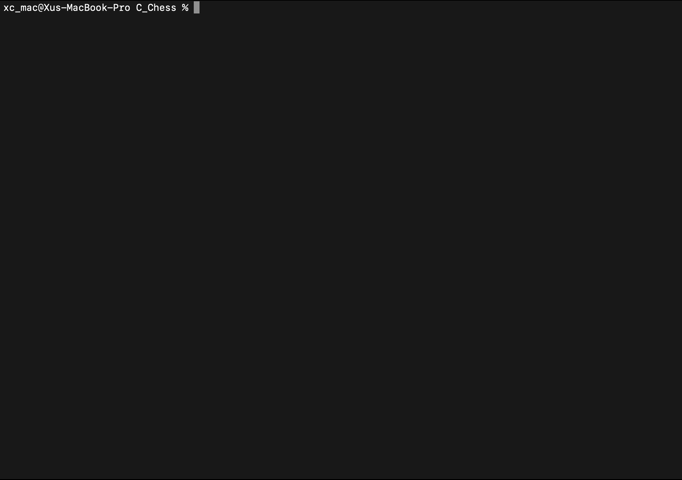

# ♟️ Terminal Chess AI in C

A fully playable terminal-based chess game built from scratch in C.  
Features human vs AI gameplay, full move validation, a tactical evaluation system, and a Minimax AI with alpha-beta pruning. Designed to run in the terminal with fast, optimized performance and support for all major chess rules.

---

## 🎮 Features

- Human vs AI chess game in the terminal
- Minimax algorithm with alpha-beta pruning
- Evaluation engine with weighted heuristics:
  - Material balance
  - Piece-square tables
  - King safety, castling bonus, fork bonuses
- Full move legality validation
  - ✅ Castling (both sides)
  - ✅ En passant
  - ✅ Pawn promotion
  - ✅ Check, checkmate, stalemate detection
- Opening book for early AI moves
- Dynamic attack maps and pinned piece logic
- Highly optimized for fast search at depth 4

---

## 🧠 AI Evaluation Heuristics (Simplified)

```c
#define VALUE_KING 9999     // arbitrarily large to prioritize king safety
#define VALUE_QUEEN 9
#define VALUE_ROOK 5
#define VALUE_BISHOP 3  
#define VALUE_KNIGHT 3      
#define VALUE_PAWN 1
#define VALUE_PASSED_PAWN 2
#define BONUS_FORK 3
#define BONUS_KING_PRESSURE 2
#define VALUE_CASTLED_KING 50
#define PENALTY_DOUBLED_PAWN 50
#define PENALTY_ISOLATED_PAWN 20
#define BONUS_BISHOP_PAIR 50
#define BONUS_CONNECTED_ROOKS 25
#define MAX_DEPTH 4
#define INFINITY 10000
```

The engine uses a mix of:
- **Tactical bonuses** (e.g., forks, pressure)
- **Positional heuristics** (e.g., doubled pawns, castling)
- **Piece-square tables** for better piece placement

---

## 🛠️ How to Compile and Run

```bash
clang -o chess chess.c
./chess
```

Runs entirely in your terminal. No dependencies.

---

## 🧪 Sample Game State

```
Move: 2e4e
AI plays: f7f6
  A B C D E F G H
8|r|n|b|q|k|b|n|r|
7|p|p|p|p|p| |p|p|
6| | | | | |p| | |
5| | | | | | | | |
4| | | | |P| | | |
3| | | | | | | | |
2|P|P|P|P| |P|P|P|
1|R|N|B|Q|K|B|N|R|
```

---

## 📷 Demo

<p align="center">
  
</p>

---

## Usage

Input moves in **0A1B** format:
---

- `0A` = starting square
- `1B` = destination square
## ⌨️ How to Play

Example:
- Input your moves in the format `2e4e` (start square + end square)
  - e.g. `2e4e` moves the piece at e2 to e4
- Promotion will prompt a piece selection (Q/R/B/N)
- The game alternates between player (White) and AI (Black)

```
Move: 2e3e
```
---

## 📈 Optimization Highlights

Recent improvements to:
- **Alpha-beta pruning logic**
- **Move legality checks** (faster pinned piece detection)
- **Memory footprint** (no dynamic memory allocation needed)

Search depth of 4 runs smoothly with sub-second response time on modern CPUs.

---

## 🧩 Project Structure

All code is written in a **single C file** with:
- Structs for board state and moves
- Modular functions for evaluation, move generation, legality, AI logic, and rendering

> 📌 Ideal for understanding how a chess engine works at a low level.

---

# Project Status
Most planned features are finished, but here are some possible upgrades:

Work in progress — major rules and features still under development.
- Add a GUI (e.g., SDL, ncurses)
- Implement PGN/FEN loading and saving
- Add support for threefold repetition and 50-move rule
- Integrate a more advanced evaluation model (e.g., neural network or centipawn analysis)
- Support UCI protocol for third-party GUI engines

---

## 🧠 Why I Built This

I really enjoy the simplicity of low level programming and to improve my skills, I decided to challenge myself to build a rule-complete chess engine from scratch, entirely in a single C file, without external libraries.
The AI uses a depth-4 minimax with tactical and positional evaluation, and was built to run cleanly and quickly in the terminal.

---

## 🙌 Credits

Developed by Xu Chen (xuchen11091). Built using C and lots of debug patience. AI inspired by traditional chess engine design principles and heuristics used in classic engines.

---

## License

MIT License (or specify if otherwise).


---

## 📬 Contact

Feel free to reach out or fork this repo if you'd like to contribute or suggest improvements.
